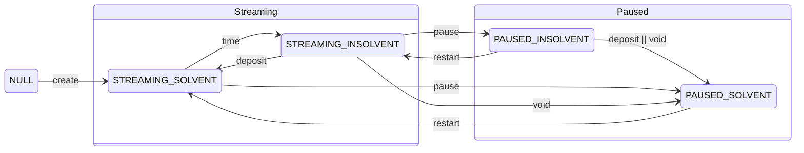
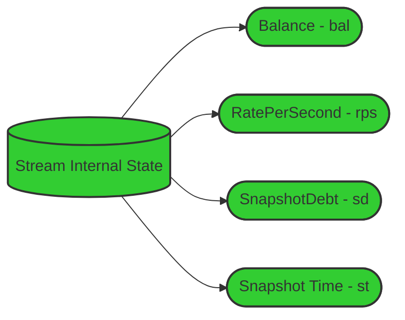
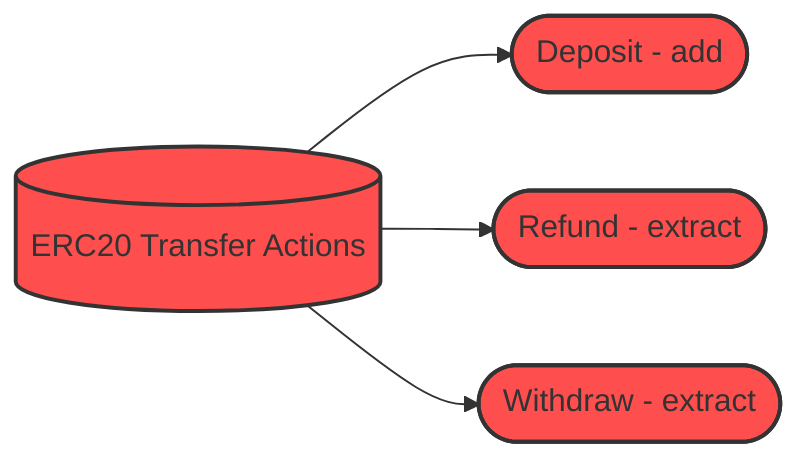
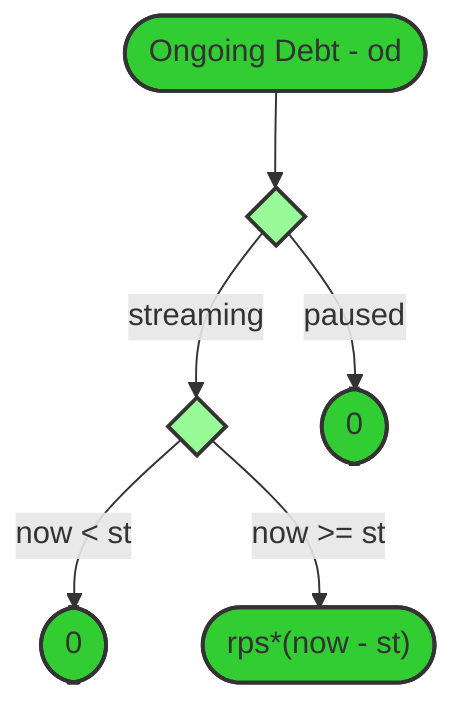
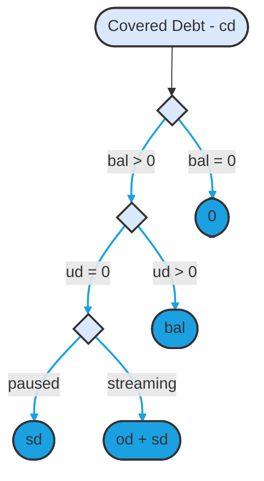
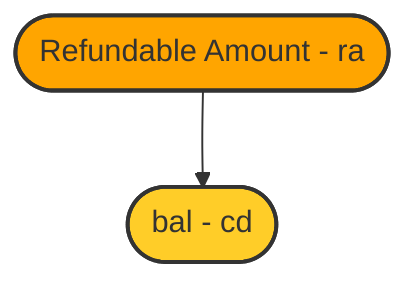
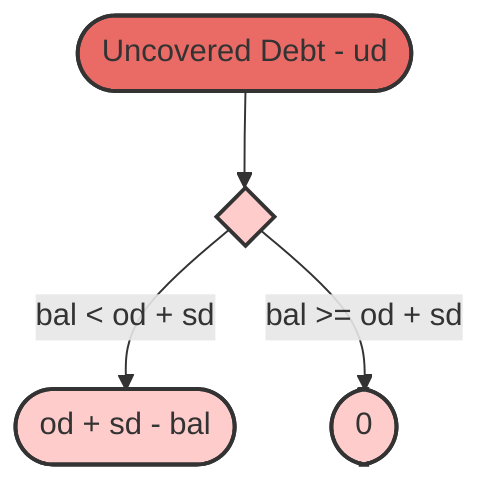

## Statuses

### Types

| Type      | Statuses                                   | Description           |
| :-------- | :----------------------------------------- | :-------------------- |
| Streaming | `STREAMING_SOLVENT`, `STREAMING_INSOLVENT` | Debt is accruing.     |
| Paused    | `PAUSED_SOLVENT`, `PAUSED_INSOLVENT`       | Debt is not accruing. |

| Status                | Description                                       |
| --------------------- | ------------------------------------------------- |
| `STREAMING_SOLVENT`   | Streaming stream when there is no uncovered debt. |
| `STREAMING_INSOLVENT` | Streaming stream when there is no uncovered debt. |
| `PAUSED_SOLVENT`      | Paused stream when there is no uncovered debt.    |
| `PAUSED_INSOLVENT`    | Paused stream when there is uncovered debt.       |

### Statuses diagram

The transition between statuses is done by specific functions, which can be seen in the text on the edges or by the
time.

### Function calls

**Notes:**

1. The arrows point to the status on which the function can be called
2. The "update" comments refer only to the internal state
3. `st` is always updated to `block.timestamp`, expect for `withdrawAt`
4. Red lines refers to the function that are doing an ERC-20 transfer

```mermaid
flowchart LR
    subgraph Statuses
        NULL((NULL)):::grey
        STR((STREAMING)):::green
        PSED((PAUSED)):::yellow
    end


    subgraph Functions
        CR([CREATE])
        ADJRPS([ADJUST_RPS])
        DP([DEPOSIT])
        WTD([WITHDRAW])
        RFD([REFUND])
        RST([RESTART])
        PS([PAUSE])
        VD([VOID])
    end

    BOTH((  )):::black

    classDef grey fill:#b0b0b0,stroke:#333,stroke-width:2px;
    classDef green fill:#32cd32,stroke:#333,stroke-width:2px;
    classDef yellow fill:#ffff99,stroke:#333,stroke-width:2px;
    classDef black fill:#000000,stroke:#333,stroke-width:2px;

    CR -- "update rps\nupdate st" --> NULL
    ADJRPS -- "update sd (+od)\nupdate rps\nupdate st" -->  STR

    DP -- "update bal (+)" --> BOTH

    RFD -- "update bal (-)" --> BOTH

    WTD -- "update sd (-) \nupdate st\nupdate bal (-)" --> BOTH

    VD -- "update sd (bal)\nupdate rps (0)" --> BOTH

    PS -- "update sd (+od)\nupdate rps (0)" --> STR

    BOTH --> STR & PSED

    RST -- "update rps \nupdate st" --> PSED

    linkStyle 2,3,4 stroke:#ff0000,stroke-width:2px
```

## Access Control

| Action              |         Sender         | Recipient | Operator(s) |      Unknown User      |
| ------------------- | :--------------------: | :-------: | :---------: | :--------------------: |
| AdjustRatePerSecond |           ✅           |    ❌     |     ❌      |           ❌           |
| Deposit             |           ✅           |    ✅     |     ✅      |           ✅           |
| Pause               |           ✅           |    ❌     |     ❌      |           ❌           |
| Refund              |           ✅           |    ❌     |     ❌      |           ❌           |
| Restart             |           ✅           |    ❌     |     ❌      |           ❌           |
| Transfer NFT        |           ❌           |    ✅     |     ✅      |           ❌           |
| Void                |           ✅           |    ✅     |     ✅      |           ❌           |
| Withdraw            | ✅ (only to Recipient) |    ✅     |     ✅      | ✅ (only to Recipient) |

### Internal State

## Amount Calculations

### Ongoing Debt

**Notes:** `now` refers to `block.timestamp`.

### Covered debt

**Notes:** Uncovered debt greater than zero means:

1. `sd > bal` when the status is `PAUSED`
2. `sd + od > bal` when the status is `STREAMING`

### Refundable Amount

### Uncovered Debt

